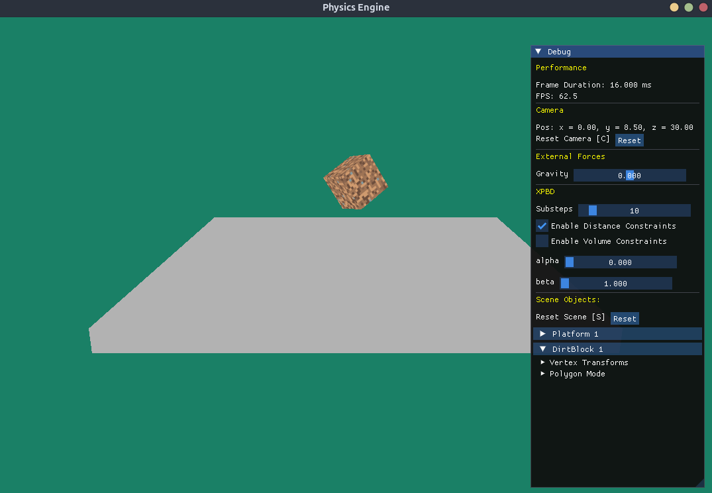

# Physics Engine

A 3D physics engine written in C++ using OpenGL for rendering. This project implements **Extended Position Based Dynamics (XPBD)** ([Macklin et al., 2019](https://matthias-research.github.io/pages/publications/smallsteps.pdf)) for realistic and efficient physics simulations.


## Features

- **3D Object Rendering**
  - Load and render `.obj` files with vertex positions, texture coordinates, and normals using [ASSIMP](https://github.com/assimp/assimp).
- **Camera System**
  - Move the camera with keyboard input.
  - Zoom in and out using the scroll wheel.
- **Physics Simulation**
  - Gravity applied to non-static objects.
  - Length constraints implemented with XPBD.


## Dependencies

- **C++20 Compiler** (e.g., g++ 10+, clang 10+)
- **CMake** (3.10 or newer)
- **OpenGL** (for rendering)
- **GLFW** (window and input handling)
- **GLM** (math library)
- **ASSIMP** (model loading)

### Install dependencies on Ubuntu/Debian

```sh
sudo apt-get update
sudo apt-get install build-essential cmake libassimp-dev libglm-dev libglfw3-dev libglew-dev
```


## Building the Project

1. **Clone the repository:**
    ```sh
    git clone https://github.com/frederic-hallein/physics-engine.git
    cd physics-engine
    ```

2. **Create a build directory and configure the project:**
    ```sh
    mkdir build
    cd build
    cmake ..
    ```

3. **Build the project:**
    ```sh
    cmake --build .
    ```

4. **Run the executable:**
    ```sh
    ./physics-engine
    ```


## Usage

### Controls

- **Camera Movement:**
  - `W` — Move forward
  - `S` — Move backward
  - `A` — Move left
  - `D` — Move right
  - `SPACE` — Move up
  - `Shift` — Move down
- **Camera Zoom:**
  - Use the scroll wheel to zoom in and out.


## Notes

- Meshes are loaded using ASSIMP, so you can use `.obj`, `.fbx`, and other supported formats.
- If you encounter errors related to missing dependencies, ensure all required libraries are installed and available to CMake.
- For custom or non-system installs of dependencies, set `CMAKE_PREFIX_PATH` or use `-D` flags with `cmake`.


## Screenshot




