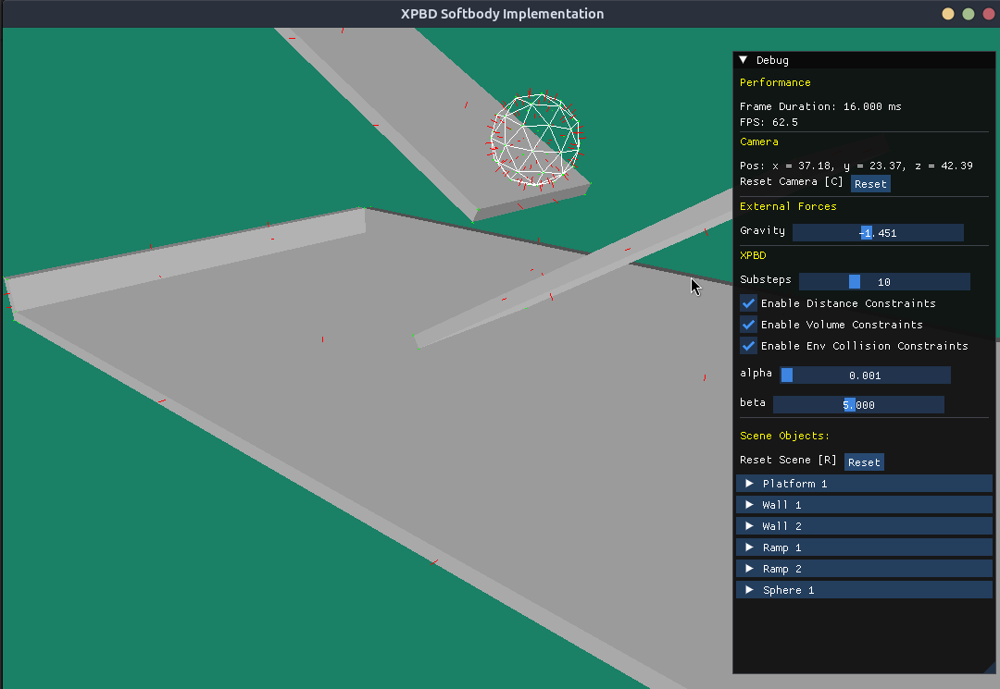

# Physics Engine

A 3D physics engine written in C++ using OpenGL for rendering. This project implements **Extended Position Based Dynamics (XPBD)** ([Macklin et al., 2019](https://matthias-research.github.io/pages/publications/smallsteps.pdf)) for realistic and efficient physics simulations.


## Features

- **3D Object Rendering**
  - Load and render `.obj` files with vertex positions, texture coordinates, and normals using [ASSIMP](https://github.com/assimp/assimp).
- **Camera System**
  - Move the camera with the mouse.
  - Zoom in and out using the scroll wheel.
- **Physics Simulation**
  - Gravity applied to non-static objects.
  - Length constraints implemented with XPBD.
  - Volume constraints implemented with XPBD (NOTE: currently unstable).


## Dependencies

- **C++20 Compiler** (e.g., g++ 10+, clang 10+)
- **CMake** (3.10 or newer)
- **OpenGL** (for rendering)
- **GLFW** (window and input handling)
- **GLM** (math library)
- **ASSIMP** (model loading)

### Install dependencies on Ubuntu/Debian

```sh
sudo apt-get update
sudo apt-get install build-essential cmake libassimp-dev libglm-dev libglfw3-dev libglew-dev
```


## Building the Project

1. **Clone the repository:**
    ```sh
    git clone https://github.com/frederic-hallein/physics-engine.git
    cd physics-engine
    ```

2. **Create a build directory and configure the project:**
    ```sh
    mkdir build
    cd build
    cmake ..
    ```

3. **Build the project:**
    ```sh
    cmake --build .
    ```

4. **Run the executable:**
    ```sh
    ./physics-engine
    ```


## Usage

### Controls

#### Scene Controls

- **Left Mouse Button + Drag:** Orbit the camera around the origin (scene center).
    - Drag left/right: Rotate camera horizontally around the origin.
    - Drag up/down: Rotate camera vertically (pitch) around the origin.
- **Mouse Scroll Wheel:** Zoom in/out (move camera closer/farther along its front vector).

#### ImGui Debug Window

- **Reset Camera Button:** Instantly returns the camera to its original position and orientation (Key shortcut C).
- **Reset Scene Button:** Resets all objects to their initial positions (Key shortcut S).
- **Gravity, Alpha, Beta Sliders:** Adjust simulation parameters using the sliders.
- **PBD Substeps:** Adjust the number of XPBD solver substeps using the slider.
- **Enable Distance Constraints:** Toggle distance constraint calculations on/off.
- **Enable Volume Constraints:** Toggle volume constraint calculations on/off.


## Screenshot




